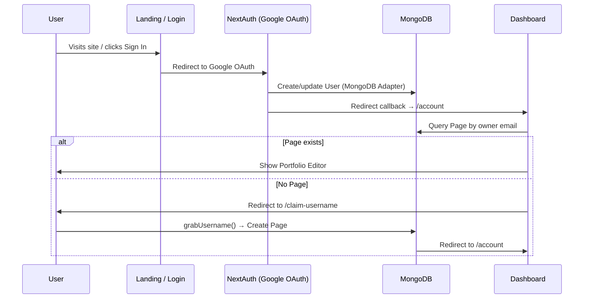

# LinkMate (linkmatrix) — Project Documentation

> **Comprehensive reference document for the LinkMate codebase.**
> Last updated: 2026-06-27

---

## 1. Project Overview

**LinkMate** is a Linktree-style professional portfolio builder with built-in analytics. Users sign in via Google, claim a unique username, and build a fully customizable portfolio page featuring:

- Bio, avatar, and background customization
- Social profile links
- Featured links with drag-and-drop reordering
- Categorized skills with proficiency levels
- Work experience timeline
- Education timeline
- Project showcase
- Detailed visitor analytics (views, clicks, traffic sources, devices, locations)

| Field         | Value                                    |
|---------------|------------------------------------------|
| **Package**   | `linkmatrix` (v0.1.0)                    |
| **Brand**     | LinkMate                                 |
| **Author**    | Jeevith Dharanish (@jdking123)           |
| **Live URL**  | https://LinkMate.vercel.app              |
| **Deploy**    | Vercel                                   |
| **Package Mgr** | Yarn                                  |
| **License**   | —                                        |

---

## 2. Tech Stack

| Category          | Technology                                                      |
|-------------------|-----------------------------------------------------------------|
| **Framework**     | Next.js 14 (App Router) — JavaScript (no TypeScript)            |
| **React**         | React 19.1.1                                                    |
| **Database**      | MongoDB (Atlas) via Mongoose 8.5.2 + native MongoClient for NextAuth adapter |
| **Auth**          | NextAuth.js 4.24.7 — Google OAuth only, `@auth/mongodb-adapter` |
| **Styling**       | Tailwind CSS 3.4.1 + custom CSS animations in `globals.css`     |
| **Icons**         | FontAwesome (brands + solid)                                    |
| **Charts**        | Recharts (primary), Chart.js + react-chartjs-2 (installed)      |
| **Animations**    | Custom canvas `ParticleNetwork`, IntersectionObserver-based `ScrollReveal`, Framer Motion 11.8 (installed) |
| **File Storage**  | AWS S3 (`ap-south-1`) via `@aws-sdk/client-s3`                  |
| **Drag & Drop**   | `react-sortablejs` + `sortablejs`                               |
| **Notifications** | `react-hot-toast`                                               |
| **Date Utilities**| `date-fns`                                                      |
| **Dev Tools**     | ESLint (`next/core-web-vitals`), PostCSS, Tailwind              |

---

## 3. Environment Variables

| Variable                 | Purpose                                            |
|--------------------------|----------------------------------------------------|
| `GOOGLE_CLIENT_ID`       | Google OAuth client ID                             |
| `GOOGLE_CLIENT_SECRET`   | Google OAuth client secret                         |
| `MONGO_URI`              | MongoDB Atlas connection string                    |
| `URL`                    | App base URL (e.g. `http://localhost:3000/`)       |
| `NEXTAUTH_URL`           | NextAuth base URL                                  |
| `SECRET`                 | NextAuth secret (referenced as `process.env.SECRET` in authOptions) |
| `S3_ACCESS_KEY`          | AWS S3 access key                                  |
| `S3_SECRET_ACCESS_KEY`   | AWS S3 secret key                                  |
| `BUCKET_NAME`            | S3 bucket name (`linkmatrix`)                      |
| `NEXT_PUBLIC_APP_URL`    | Public-facing app URL (defaults to `https://LinkMate.vercel.app`) |

> [!CAUTION]
> The `.env` file contains **real credentials** and is committed to the repo. These should be moved to `.env.local` (which is gitignored).

---

## 4. Project Structure

```
linkmatrix/
├── .env                          # Environment variables (⚠️ contains secrets)
├── .eslintrc.json                # ESLint config (extends next/core-web-vitals)
├── .gitignore
├── CLAUDE.md                     # Claude Code reference
├── README.md                     # Project readme
├── jsconfig.json                 # Path alias: @/* → ./src/*
├── next.config.js                # Next.js configuration
├── package.json
├── postcss.config.mjs            # PostCSS with Tailwind plugin
├── tailwind.config.js            # Tailwind CSS configuration
├── yarn.lock
│
├── public/
│   ├── RESUME.pdf
│   ├── favicon.svg
│   ├── profile.jpg
│   ├── next.svg
│   └── vercel.svg
│
└── src/
    ├── actions/                  # Next.js Server Actions (camelCase)
    │   ├── grabUsername.js        # Atomic username claim
    │   └── pageActions.js        # All portfolio CRUD operations (~460 lines)
    │
    ├── app/                      # Next.js App Router
    │   ├── favicon.ico
    │   ├── globals.css           # Design system + animations (~429 lines)
    │   ├── layout.js             # Root layout: Inter font, SessionWrapper
    │   ├── page.js               # Root: redirect logged-in → /account, else landing
    │   │
    │   ├── (app)/                # ── AUTHENTICATED route group ──
    │   │   ├── layout.js         # Metadata only
    │   │   ├── template.js       # Auth guard, sidebar + mobile nav, Toaster
    │   │   ├── account/
    │   │   │   └── page.js       # Portfolio editor dashboard
    │   │   ├── analytics/
    │   │   │   └── page.js       # Analytics dashboard (~278 lines)
    │   │   └── claim-username/
    │   │       └── page.js       # Username claim page
    │   │
    │   ├── (page)/               # ── PUBLIC route group ──
    │   │   └── [uri]/
    │   │       ├── layout.js     # Passthrough layout
    │   │       └── page.js       # Public portfolio page (~571 lines, largest file)
    │   │
    │   ├── api/                  # ── API Routes ──
    │   │   ├── layout.js         # Passthrough
    │   │   ├── auth/[...nextauth]/
    │   │   │   └── route.js      # NextAuth config (Google OAuth + MongoDB adapter)
    │   │   ├── click/
    │   │   │   └── route.js      # Click tracking API (POST)
    │   │   └── upload/
    │   │       └── route.js      # S3 file upload API (POST)
    │   │
    │   └── main/                 # ── PUBLIC pages ──
    │       ├── layout.js         # Passthrough
    │       ├── page.js           # Landing page (alternate)
    │       └── login/
    │           └── page.js       # Login page (Google OAuth)
    │
    ├── components/               # React Components
    │   ├── formitems/
    │   │   └── RadioTogglers.js  # Radio button toggle group
    │   ├── icons/
    │   │   └── RightIcon.js      # Arrow right SVG
    │   │
    │   ├── ui/                   # Reusable UI primitives
    │   │   ├── LoginWithGoogle.js
    │   │   ├── LogoutButton.js
    │   │   ├── SubmitButton.js
    │   │   └── ThemeToggle.js
    │   │
    │   ├── layout/               # Global page layouts
    │   │   ├── AccountHeader.js
    │   │   ├── AppSideBar.js
    │   │   ├── Header.js
    │   │   └── SectionBox.js
    │   │
    │   └── features/             # Domain specific components
    │       ├── analytics/        # Analytics graphs and widgets
    │       │   ├── ActivityFeed.js
    │       │   ├── BreakdownCard.js
    │       │   ├── Chart.js
    │       │   ├── StatCard.js
    │       │   └── WeekTotalStats.js
    │       │
    │       ├── auth/             # Auth providers
    │       │   └── SessionWrapper.js
    │       │
    │       ├── portfolio/        # Portfolio features
    │       │   ├── feedback/
    │       │   │   └── UsernameFormResult.js
    │       │   ├── page-forms/   # Editor CRUD forms
    │       │   │   ├── HeroForm.js
    │       │   │   ├── PageButtonsForm.js
    │       │   │   ├── PageEducationForm.js
    │       │   │   ├── PageLinksForm.js
    │       │   │   ├── PageProjectForm.js
    │       │   │   ├── PageSettingsForm.js
    │       │   │   ├── PageSkillsForm.js
    │       │   │   ├── PageSummaryForm.js
    │       │   │   ├── PageWorkExperienceForm.js
    │       │   │   ├── UsernameForm.js
    │       │   │   └── UsernameFormWrapper.js
    │       │   └── page-sections/ # Public viewer sections
    │       │       ├── EducationSection.js
    │       │       ├── ProjectSection.js
    │       │       ├── SkillsSection.js
    │       │       ├── SummarySection.js
    │       │       └── WorkExperienceSection.js
    │       │
    │       └── theme/            # Styling providers
    │           └── ThemeProvider.js
    │
    ├── lib/                      # Client initializations & configs (singular)
    │   ├── analytics.js          # Analytics data fetching + aggregation
    │   ├── mongoClient.js        # Mongoose + MongoClient connections
    │   ├── notify.js             # Toast notification helper
    │   ├── socialButtons.js      # Social platform config
    │   ├── track.js              # Visitor tracking
    │   ├── upload.js             # Client-side S3 upload helper
    │   └── urlHelpers.js         # URL & hashing helpers
    │
    └── models/                   # Mongoose Database Models (PascalCase)
        ├── DeletedLink.js        # Preserves deleted links for analytics history
        ├── Education.js          # Education entries
        ├── Event.js              # Analytics events (views + clicks)
        ├── Page.js               # Central portfolio document (renamed from page.js)
        ├── Project.js            # Project entries
        ├── User.js               # Auth user (name, email, image)
        └── WorkExperience.js     # Work experience entries
```

---

## 5. Database Models & Relationships

### Page (Central Document)
The core data model — each user has one `Page` document.

| Field             | Type           | Description                                      |
|-------------------|----------------|--------------------------------------------------|
| `uri`             | String (unique)| Username / page slug                             |
| `owner`           | String         | User's email — links to User                     |
| `displayName`     | String         | Display name                                     |
| `location`        | String         | User's location                                  |
| `bio`             | String         | Short bio text                                   |
| `bgType`          | String         | Background type (color / image)                  |
| `bgColor`         | String         | Background color hex                             |
| `bgImage`         | String         | Background image URL (S3)                        |
| `profileImage`    | String         | Avatar URL (S3)                                  |
| `buttons`         | Object         | Social platform key-value pairs                  |
| `links`           | Array          | Featured links `[{ key, title, subtitle, icon, url }]` |
| `skills`          | Mixed          | Categorized: `{ "Category": [{ name, proficiency }] }` |
| `summary`         | String         | About me / summary text                          |
| `showAvailableBadge` | Boolean     | Show "Available" badge (default: `true`)         |

### User
Managed by NextAuth + MongoDB adapter.

| Field            | Type   |
|------------------|--------|
| `name`           | String |
| `email`          | String |
| `image`          | String |
| `emailVerified`  | Date   |

### Education

| Field         | Type   |
|---------------|--------|
| `school`      | String |
| `degree`      | String |
| `start`       | String |
| `end`         | String |
| `cgpa`        | String |
| `description` | String |
| `owner`       | String (email) |
| `pageUri`     | String |

### WorkExperience

| Field     | Type     |
|-----------|----------|
| `company` | String   |
| `role`    | String   |
| `start`   | String   |
| `end`     | String   |
| `bullets` | [String] |
| `owner`   | String   |
| `pageUri` | String   |

### Project

| Field        | Type   |
|--------------|--------|
| `title`      | String |
| `techStacks` | String |
| `timeTaken`  | String |
| `summary`    | String |
| `githubLink` | String |
| `liveLink`   | String |
| `owner`      | String |
| `pageUri`    | String |

### Event (Analytics)

| Field         | Type                             |
|---------------|----------------------------------|
| `type`        | `'view'` \| `'click'`           |
| `page`        | String (uri)                     |
| `uri`         | String (clicked URL)             |
| `clickType`   | `'link'` \| `'social'` \| `'project'` |
| `referrer`    | String                           |
| `visitorHash` | String (SHA-256, truncated 16)   |
| `country`     | String                           |
| `city`        | String                           |
| `userAgent`   | String                           |
| `isOwner`     | Boolean                          |

### DeletedLink

| Field            | Type   |
|------------------|--------|
| `originalLinkId` | String |
| `title`          | String |
| `url`            | String |
| `icon`           | String |
| `subtitle`       | String |
| `pageUri`        | String |
| `owner`          | String |
| `totalClicks`    | Number |
| `deletedAt`      | Date   |

### Relationships

All related models (`Education`, `WorkExperience`, `Project`) connect to `Page` via `owner` (email) + `pageUri` (plain string matching — no Mongoose refs/populate).

---

## 6. API Endpoints

| Method   | Endpoint                                                            | Auth | Description                                                           |
|----------|---------------------------------------------------------------------|------|-----------------------------------------------------------------------|
| GET/POST | `/api/auth/[...nextauth]`                                          | —    | NextAuth handler — Google OAuth flow + MongoDB adapter                |
| POST     | `/api/click?url={base64}&page={uri}&clickType={link\|social\|project}` | No   | Records click events with visitor metadata. Filters bots, flags owner visits. |
| POST     | `/api/upload`                                                      | Yes  | Uploads files to S3. Max 5MB. Allowed: JPEG, PNG, WebP, GIF, PDF. Returns public S3 URL. |

---

## 7. Server Actions

Server Actions are the **primary mutation path** for all dashboard operations (not REST).

### `src/actions/pageActions.js` (~460 lines)

| Action                                  | Description                                                                 |
|-----------------------------------------|-----------------------------------------------------------------------------|
| `savePageSettings(formData)`            | Updates displayName, location, bio, bgType, bgColor, bgImage, showAvailableBadge, avatar |
| `savePageButtons(formData)`             | Updates social platform URLs                                                |
| `savePageLinks(links)`                  | Updates featured links. Tracks deleted links in `DeletedLink`, restores if re-added |
| `savePageEducation(uri, educationData)` | Delete-all + insert pattern with Mongoose transactions                      |
| `savePageSkills(uri, skillsData)`       | Updates categorized skills with proficiency                                 |
| `savePageWorkExperience(uri, workData)` | Delete-all + insert pattern with Mongoose transactions                      |
| `savePageSummary(uri, summary)`         | Updates about me text                                                       |
| `savePageProject(uri, projectData)`     | Delete-all + insert pattern with Mongoose transactions                      |

### `src/actions/grabUsername.js`

| Action                    | Description                                                                                  |
|---------------------------|----------------------------------------------------------------------------------------------|
| `grabUsername({ username })` | Atomic upsert username claim. Validates format (3–30 chars, lowercase alphanumeric + hyphens/underscores). Race-safe via `findOneAndUpdate` with `$setOnInsert`. |

> [!IMPORTANT]
> **Security**: All server actions verify the session, sanitize strings (strips `<script>`, `javascript:`, event handlers), sanitize URLs (whitelist protocols), and clamp proficiency values.

---

## 8. Routing Map

| Route              | Type          | Description                                                        |
|--------------------|---------------|--------------------------------------------------------------------|
| `/`                | Public/Redirect | Landing page with hero form. Redirects to `/account` if logged in. |
| `/main`            | Public        | Alternative landing page                                           |
| `/main/login`      | Public        | Login page with Google OAuth button                                |
| `/account`         | Auth Required | Portfolio editor dashboard. Redirects to `/claim-username` if no page exists. |
| `/analytics`       | Auth Required | Full analytics dashboard                                           |
| `/claim-username`  | Auth Required | Username claim form for new users                                  |
| `/[uri]`           | Public        | Dynamic public portfolio page (server-rendered, SEO-optimized)     |

### Route Groups

- **`(app)/`** — Authenticated route group. `template.js` acts as auth guard (checks session server-side), renders sidebar + mobile nav + `<Toaster>`.
- **`(page)/`** — Public route group. Hosts the dynamic `[uri]` portfolio pages.

---

## 9. Authentication Flow



**Key details:**
- Auth provider: **Google only**
- Adapter: `@auth/mongodb-adapter` (native MongoClient)
- Session strategy: default (JWT)
- Secret: `process.env.SECRET` (note: not `NEXTAUTH_SECRET`)
- Error page: `/login`
- Auth guard: `(app)/template.js` server component (not middleware)
- Pre-auth username stored in `localStorage`, restored post-auth via `UsernameFormWrapper`

---

## 10. Analytics System

### Data Collection

| Signal       | Method                                                                                  |
|--------------|-----------------------------------------------------------------------------------------|
| **Views**    | Server-side in `[uri]/page.js` during SSR. Non-blocking `Event.create()`. Skips bots.  |
| **Clicks**   | HTML `ping` attribute on `<a>` tags. URLs base64-encoded. Tracked via `/api/click`.     |
| **Visitor ID** | IP-based SHA-256 hash (salted with `NEXTAUTH_SECRET`, truncated to 16 chars)          |
| **Geo**      | Country/city from Vercel/Cloudflare edge headers                                        |
| **Referrer** | HTTP `Referer` header, overridden by `?ref=` query param                                |

### Dashboard Metrics (`libs/analytics.js`)

- Total & today views, link clicks, social clicks, project clicks
- Click-through rate (link clicks ÷ views)
- Week-over-week trends (7-day vs previous 7-day comparison)
- Per-link performance (active + deleted links, ranked by clicks)
- Per-social-button click counts
- Per-project GitHub / live demo click counts
- Daily views + clicks chart data (Recharts bar chart, weekly/monthly/yearly toggle)
- Traffic sources (parsed referrer → LinkedIn, Google, GitHub, etc.)
- Top locations (country + city)
- Device breakdown (Mobile / Desktop / Tablet from UA)
- Unique / returning visitors (via `visitorHash`)
- Recent visitor sessions (grouped by 30-min session gap, last 10)

### Deleted Link Tracking

When a link is removed, its click count is snapshot into the `DeletedLink` collection. Analytics include deleted links at the bottom with a "deleted" badge. If a link with the same URL is re-added, the `DeletedLink` record is removed.

---

## 11. Key Design Patterns

| Pattern                        | Where / How                                                                        |
|--------------------------------|------------------------------------------------------------------------------------|
| **Server Actions over REST**   | All dashboard mutations use Next.js Server Actions, not REST API routes             |
| **Atomic upsert**              | Username claiming uses `findOneAndUpdate` with `$setOnInsert` for race safety       |
| **Mongoose transactions**      | Education, WorkExperience, Project saves use MongoDB sessions with `startTransaction` / `commitTransaction` / `abortTransaction` |
| **Input sanitization**         | Centralized `sanitizeString()` and `sanitizeUrl()` helpers strip XSS vectors        |
| **Connection caching**         | Both Mongoose and MongoClient connections cached in `global` to survive HMR          |
| **Data serialization**         | Mongoose docs serialized via `JSON.parse(JSON.stringify())` before client components |
| **Click tracking via `ping`**  | HTML5 `ping` on `<a>` sends beacons without JS. URLs are base64-encoded             |
| **Page caching**               | `unstable_cache` with 60s revalidation on public portfolio pages                    |
| **Bot filtering**              | Extensive regex to skip link-preview crawlers from analytics counts                 |
| **Owner visit exclusion**      | Owner's own visits are flagged with `isOwner: true` and excluded from analytics     |

---

## 12. Configuration Files

### `next.config.js`
- **Images**: Remote patterns for `*.googleusercontent.com` and `linkmatrix.s3.amazonaws.com`. AVIF/WebP. 60s cache TTL.
- **React Strict Mode**: Enabled
- **Compression**: Enabled
- **Powered-by header**: Disabled
- **Experimental**: `optimizePackageImports` for FontAwesome and `date-fns`

### `tailwind.config.js`
- **Dark mode**: Class-based
- **Custom fonts**: Inter (system-ui fallback)
- **Custom backgrounds**: `gradient-radial`, `gradient-conic`, `gradient-primary` (indigo → violet)
- **Custom shadows**: `card`, `card-hover`, `elevated`
- **Design tokens** (CSS variables): `--primary-start` (#6366f1), `--primary-end` (#8b5cf6), `--bg-main` (#f8fafc), etc.

### `jsconfig.json`
- Path alias: `@/*` → `./src/*`

### `postcss.config.mjs`
- Plugins: `tailwindcss`, `autoprefixer`

### `.eslintrc.json`
- Extends: `next/core-web-vitals`

---

## 13. CSS Animation System

Defined in `src/app/globals.css` (~429 lines):

**Keyframe animations**: `spin-slow`, `gradient-shift`, `float`, `fade-in-up`, `glow`, `pulse-soft`, `shimmer`, `pop-in`, `dot-pulse`, `timeline-draw`, `fill-progress`

**ScrollReveal system**: CSS classes `scroll-reveal--fade-up`, `--slide-left`, `--slide-right`, `--scale-up`, `--flip-up` with `scroll-revealed` active state. Uses CSS custom properties for delay/duration.

**Accessibility**: `prefers-reduced-motion` media query disables all animations.

---

## 14. Third-Party Integrations

| Service          | Purpose                                             |
|------------------|-----------------------------------------------------|
| **Google OAuth** | Authentication (via NextAuth)                       |
| **AWS S3**       | Image/file storage (region: `ap-south-1`, bucket: `linkmatrix`) |
| **MongoDB Atlas**| Database                                            |
| **Vercel**       | Deployment platform (uses edge headers for geo data) |

---

## 15. Scripts

```json
{
  "dev": "next dev",
  "build": "next build",
  "start": "next start",
  "lint": "next lint"
}
```

---

## 16. Development Notes

> [!NOTE]
> - **No test framework** is configured.
> - **No middleware.js** file — auth protection is done in `(app)/template.js`.
> - Path alias `@/` maps to `src/`.

> [!WARNING]
> **Naming inconsistency**: The npm package is `linkmatrix`, but the UI and README brand it as **LinkMate**.

> [!WARNING]
> **Unused dependencies**: `leaflet`, `leaflet.heat`, `react-leaflet`, `react-simple-maps`, `framer-motion`, `chart.js`, `axios`, `bcrypt`, `clone-deep`, `dom-helpers`, `react-transition-group`, `plain-object-clone`, `ipinfo` are installed but not referenced in current source code.

---

## 17. Component Reference

### Layout Components
| Component          | File                              | Purpose                              |
|--------------------|-----------------------------------|--------------------------------------|
| `AccountHeader`    | `components/layout/AccountHeader.js` | Dashboard header with page URL + copy button |
| `AppSideBar`       | `components/layout/AppSideBar.js`    | Dashboard sidebar navigation         |
| `SectionBox`       | `components/layout/SectionBox.js`    | Reusable card wrapper                |
| `Header`           | `components/Header.js`               | Public site header with auth state   |
| `SessionWrapper`   | `components/SessionWrapper.js`       | NextAuth `SessionProvider` wrapper   |

### Form Components
| Component                | File                                          | Purpose                                 |
|--------------------------|-----------------------------------------------|-----------------------------------------|
| `HeroForm`               | `components/forms/HeroForm.js`                | Landing page username claim             |
| `PageSettingsForm`        | `components/forms/PageSettingsForm.js`         | Profile settings (name, bio, avatar, bg)|
| `PageButtonsForm`         | `components/forms/PageButtonsForm.js`          | Social platform links editor            |
| `PageLinksForm`           | `components/forms/PageLinksForm.js`            | Featured links editor (drag-sortable)   |
| `PageSkillsForm`          | `components/forms/PageSkillsForm.js`           | Categorized skills editor (most complex)|
| `PageEducationForm`       | `components/forms/PageEducationForm.js`        | Education CRUD                          |
| `PageWorkExperienceForm`  | `components/forms/PageWorkExperienceForm.js`   | Work experience CRUD                    |
| `PageSummaryForm`         | `components/forms/PageSummaryForm.js`          | About me editor                         |
| `PageProjectForm`         | `components/forms/PageProjectForm.js`          | Projects CRUD                           |
| `UsernameForm`            | `components/forms/UsernameForm.js`             | Username claim form                     |
| `UsernameFormWrapper`     | `components/forms/UsernameFormWrapper.js`       | localStorage bridge for username        |

### Analytics Components
| Component         | File                                    | Purpose                            |
|-------------------|-----------------------------------------|------------------------------------|
| `Chart`           | `components/Chart.js`                   | Recharts bar chart (views + clicks)|
| `StatCard`        | `components/analytics/StatCard.js`      | Summary stat with trend badge      |
| `BreakdownCard`   | `components/analytics/BreakdownCard.js` | Ranked list with proportional bars |
| `WeekTotalStats`  | `components/analytics/WeekTotalStats.js`| 7-day vs total stat pair           |
| `ActivityFeed`    | `components/analytics/ActivityFeed.js`  | Recent visitor sessions feed       |

### Public Profile Sections
| Component                 | File                                           | Purpose                    |
|---------------------------|------------------------------------------------|----------------------------|
| `SummarySection`          | `components/profile/SummarySection.js`         | About me quote block       |
| `SkillsSection`           | `components/profile/SkillsSection.js`          | Categorized skills + bars  |
| `WorkExperienceSection`   | `components/profile/WorkExperienceSection.js`  | Work timeline              |
| `EducationSection`        | `components/profile/EducationSection.js`       | Education timeline         |
| `ProjectSection`          | `components/profile/ProjectSection.js`         | Project showcase cards     |

### Animation Components
| Component         | File                                      | Purpose                        |
|-------------------|-------------------------------------------|--------------------------------|
| `ParticleNetwork` | `components/animations/ParticleNetwork.js`| Canvas particle animation      |
| `ScrollReveal`    | `components/animations/ScrollReveal.js`   | IntersectionObserver scroll FX |

### Buttons
| Component          | File                                    | Purpose                 |
|--------------------|-----------------------------------------|-------------------------|
| `LoginWithGoogle`  | `components/buttons/LoginWithGoogle.js` | Google sign-in button   |
| `LogoutButton`     | `components/buttons/LogoutButton.js`    | Sign-out button         |
| `SubmitButton`     | `components/buttons/SubmitButton.js`    | Form submit + loading   |

---

## 18. Utility Modules

| Module            | File                       | Purpose                                                                  |
|-------------------|----------------------------|--------------------------------------------------------------------------|
| `analytics.js`    | `libs/analytics.js`        | `getAnalytics()` — fetches + aggregates all analytics data (~238 lines)  |
| `mongoClient.js`  | `libs/mongoClient.js`      | Mongoose + MongoClient connections (cached in `global` for HMR)          |
| `notify.js`       | `libs/notify.js`           | Toast notification helper                                                |
| `socialButtons.js`| `libs/socialButtons.js`    | Social platform config (icons, labels, base URLs)                        |
| `track.js`        | `libs/track.js`            | Visitor tracking: bot detection regex, visitor hash generation, geo extraction, source detection |
| `upload.js`       | `libs/upload.js`           | Client-side S3 upload helper                                            |
| `urlHelpers.js`   | `libs/urlHelpers.js`       | Base64 encoding, click ping URL builder                                  |
